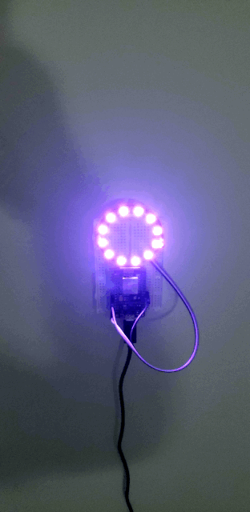

# micropython

Scripts for my experiments with micropython board (NodeMCU) and neopixel.

# Parts:
- [NeoPixel Ring](https://www.amazon.com/gp/product/B073R6P2FW)
- [NodeMCU](https://www.amazon.com/gp/product/B010O1G1ES)

# Tools
- [Micropython webrepl](http://micropython.org/webrepl/)
- [esptool.py](https://pypi.org/project/esptool/)

# Demo

